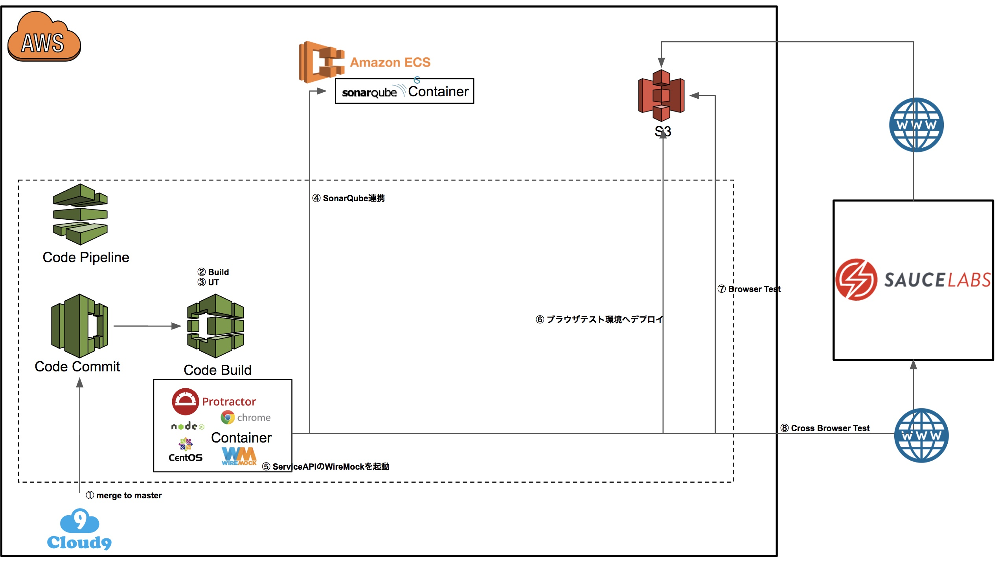

# nuxt-pipeline-aws
AWS上で構築したnuxtプロジェクトのパイプラインのサンプルです。

## 構成

## Sauce Labsの設定
- [PCのCapabilities設定説明](https://wiki.saucelabs.com/display/DOCS/Platform+Configurator#/)
- [Real DeviceのCapabilities設定説明](https://wiki.saucelabs.com/display/DOCS/Appium+Capabilities+for+Real+Device+Testing#AppiumCapabilitiesforRealDeviceTesting-SettingAppiumCapabilities)